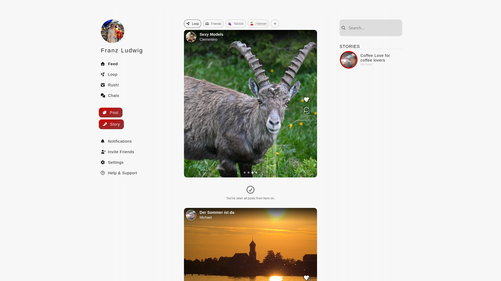
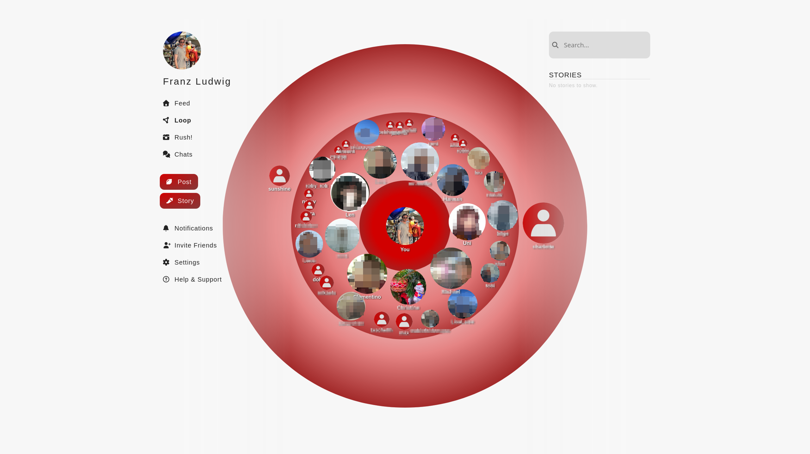
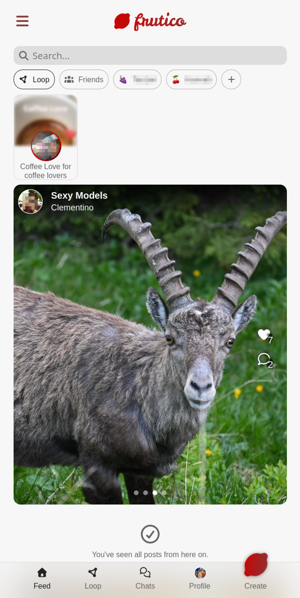
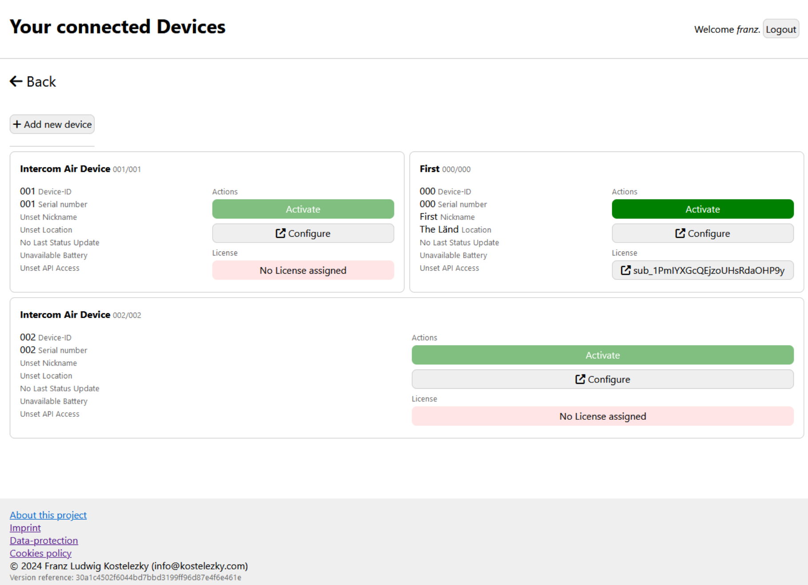
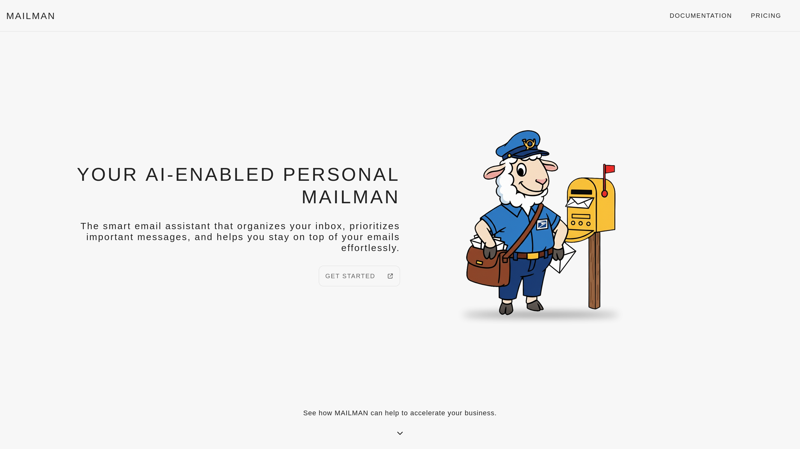
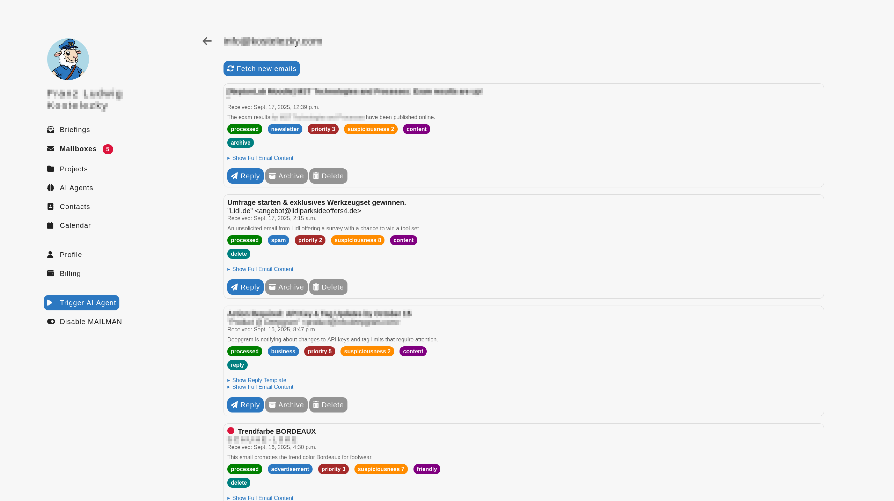

# **Franz Ludwig Kostelezky** | Featured Projects
Fullstack Software Engineer • Infra • Embedded Software

> I enjoy building reliable systems—from low-level embedded applications to distributed backend services and cloud-native infrastructure. My work combines software engineering, automation, systems design, and operations with a strong hands-on approach.

**Core Technologies**
Python • C++ • TypeScript • Docker • Django • PostgreSQL • MQTT • CI/CD

**Professional Experience**
Visit my [LinkedIn](https://www.linkedin.com/in/flemk/) profile for details.

**Areas of Interest**
Backend Engineering • Frontend Engineering • UI/UX Design • Platform Engineering • Embedded Systems • Distributed Systems • Automation

## Homelab Operator
[visit GitHub repository ⭧](https://github.com/flemk/homelab-operator)

Management platform for self-hosted environments: Manage your homelab devices, automate tasks, route traffic, and monitor your infrastructure from a single web interface.

* Automatic Wake-on-LAN and remote shutdown
* Automation tooling
* Infrastructure monitoring
* Web-based administration interface
* Progressive Web Application (PWA) with responsive design
* Containerized and easily deployable

**Tech Stack**
Python • Django • Docker • Linux

    
<b>Inspiration</b> Show screenshots

    

        
    

    
<b>Infrastructure</b>

    Infrastructure details coming soon.

## frutico
`private repository` | [visit frutico.net ⭧](https://frutico.net)

An invite-only social networking platform built as a Progressive Web Application (PWA) serving 50+ active users. Frutico offers a modern alternative to traditional social media platforms, offering the same and new features, suitable for small communities and groups of friends.

* Invitation-only community platform
* End-to-end encrypted messaging
* Real-time communication features
* Responsive mobile-first design
* Stories, posts, profiles, groups, rushes & loop (new content format!), and more
* Containerized deployment infrastructure

**Tech Stack**
Django • PostgreSQL • Docker • NGINX • JavaScript

    
<b>Inspiration</b> Show screenshots

    

        
        
        
        
    

    
<b>Infrastructure</b>

    For security reasons, the infrastructure details of frutico.net are not publicly disclosed.

## "Intercom"
`private repository`

Smart-home intercom and door management system: Extends your existing intercom with smart features, allowing you to control your door lock and manage access through a web interface and mobile app.

* Integration with legacy intercom hardware
* Electronic door lock control
* Mobile and web applications
* MQTT-based communication
* Subscription-based remote access platform

**Tech Stack**
C++ • Python • NodeJS • Django • MQTT • Docker • Flutter

    
<b>Inspiration</b> Show screenshots

    

        
    

    
<b>Infrastructure</b>

    Infrastructure details coming soon.

## "Radius"
`private repository`

Digital fitness assessment management platform for rehabilitation centers: Streamlines the fitness assessment process for rehabilitation centers, providing tools for managing clients, sessions, and reporting.

* Automated and user-customizable fitness evaluation workflows
* Digital replacement for manual assessment processes
* Client and session management
* Reporting and analytics

**Tech Stack**
Python • Django • MySQL • Docker

## Mailman
`private repository`

AI powered mail processing and automation platform: Automate your email workflows with AI-driven processing, categorization, and response generation.

* AI-powered email categorization and prioritization
* Automated response generation
* Security features: Whitelist/blacklist management for AI processing
* User-friendly interface for managing email workflows
* Providing AI agents access to contextual information
* Calendar integration for scheduling and reminders

**Tech Stack**
Python • Django • Docker • OpenAI API

    
<b>Inspiration</b> Show screenshots

    

        
        
    

    
<b>Infrastructure</b>

    Infrastructure details coming soon.

